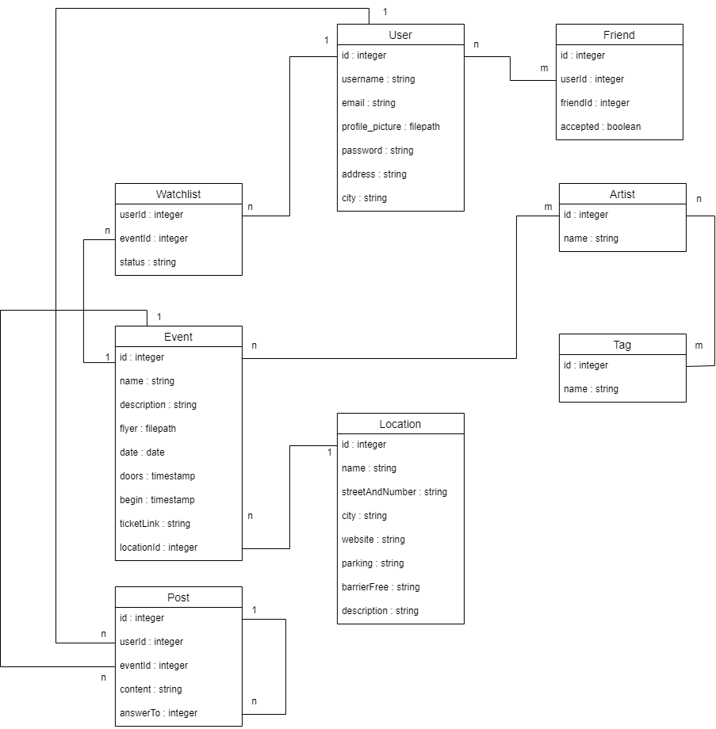

# Code
Dieses Dokument soll eine kurze Einführung in den Source Code geben, damit mögliche Beitragende nicht erst alle an Frameworks lernen müssen.

Hier dennoch die Verlinkungen zu den verschiedenen Dokumentationen:<br>
[Laravel](https://laravel.com/docs/9.x)<br>
[Vue](https://vuejs.org/guide/introduction.html)<br>
[Vue Pinia](https://pinia.vuejs.org/core-concepts/)<br>
[Vue Router](https://router.vuejs.org/guide/)<br>
[Bootstrap](https://getbootstrap.com/docs/5.3/getting-started/introduction/)<br>

## Domain Model


## Datenstruktur
Unter ./database/migrations befinden sich Migrations-Dateien, in welchen die Struktur der Models festgelegt werden. Dazu zählen der Typ, der Name und weitere zusätzliche Attribute wie Unique oder Nullable. Ebenfalls können hier vorhandene Fremdbeziehungen mit Forgein-Key-Constraints hinterlegt werden.<br>
Im Falle des Künstlers sieht dies folgendermaßen aus:
````php
Schema::create('artists', function (Blueprint $table) {
    $table->id();
    //      Typ     Name    Zusätze
    $table->string('name')->unique();
    $table->timestamps();
});
````

Die eigentlichen Model-Klassen befinden sich in ./app/Models. Hier werden nochmals die Relationen in Code-Form aufgeschrieben. Diese setzen sich aus dem Namen der Beziehung, der Art und der Referenzierten Klasse zusammen.<br>
Hier einmal die Beziehung vom Künstler zu Tags:
````php
public function tags() {
    return $this->belongsToMany(Tag::class);
}
````

Bei Änderungen, insbesondere beim Hinzufügen oder Umbennen von Attributen, müssen im Model auch die Attributsnamen aktualisiert werden. Dies geschieht über das ``$fillable``-Array, welches eine Sicherheitsmaßnahme für Mass-Assignment-Operationen ist.

## Datenmanipulation
In ./app/Http/Controllers befinden sich die Controller der Models mit CRUD Operationen und weiteren Funktionalitäten. Eine CRUD-Operation sollte möglichst immer nach einem bestimmten Ablauf aufgebaut sein. <br>
Zuerst die Validierung von Request-Daten, ggf. Fehlerfälle abarbeiten, dann den Datensatz erstellen oder aktualisieren und zurückgeben.<br>
````php
public function createArtist(Request $request) {
    // Validierung
    $request = $request->validate([
        'name' => 'required|unique:artists|string'
    ]);

    // Erstellung
    $artist = Artist::create([
        'name' => $request['name']
    ]);

    // Zurückgeben
    return $artist;
}
````

## Routen
Unter ./routes/web.php befinden sich Web-Routen, welche intern vom User genutzt werden. Sie werden genutzt für den Datenaustausch zwischen Frontend und Backend.<br>
Jede Route innerhalb der Gruppen "Auth", kann nur mit einem eingeloggten User genutzt werden. Die Routen über der Gruppe sind die Login und Registrierungs-Routen.<br>
Außerdem besteht auch eine inhaltliche Trennung zu API-Routen, sollten welche existieren.<br>
Eine Web-Route besteht aus einer Route-Methode wie *POST* oder *GET*, der URL und möglichen URL-Parametern, sowie einer auszuführenden Funktion und einem ggf. benötigtem Controller-Verweiß, welcher die Funktion beherbergt.
````php
Route::get('/artists', [ArtistController::class, 'getArtists']);
````

## Einstiegspunkt Frontend
In ./resources/views/app.blade.php ist die programmatische Startseite zu finden. Hier werden auch das kompilierte JavaScript und CSS eingebunden.<br>
Ebenfalls wird hier überprüft, ob der Nutzer eingelogged ist, und ihm somit entweder das Dashboard oder die Login-Seite zu zeigen.<br>


