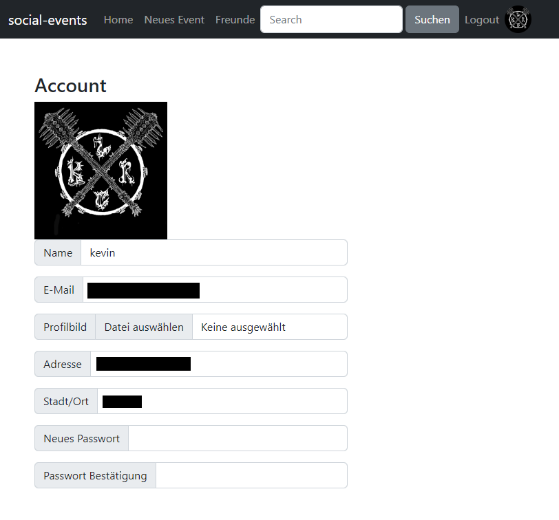

# Nutzung

## Login
Die Login-Seite ist die allgemeine Startseite für nicht angemeldete Benutzer. Hierrüber können sich neue Nutzer registrieren sowie bestehende einloggen. 
Bei fehlerhaften Login-Versuchen wird dem Nutzer mitgeteilt das seine Anmeldedaten nicht korrekt sind. Ebenfalls werden bei der Registrierung Informationen angezeigt, sollte eine angegebene E-Mail oder ein Username bereits im System vorhanden sein.

## Account
Durch die Account Seite lassen sich die Informationen des Nutzers bearbeiten. Dazu zählen das Ändern des Usernames, der E-Mail sowie das Passwort und das Hochladen eines Profilbildes. 
Außerdem können Nutzer ihren Wohnort mit Adresse festlegen. Diese Angaben sind freiwillig, und dienen rein für die Berechnung von Entfernungen zu Veranstaltungsorten.

## Event Erstellen
Über die Navbar lässt sich die Seite für die Eventerstellung öffnen. Diese besteht aus dem Formular und einer Vorschau der Eventansicht.  
Das Formular besteht aus neun Eingabefeldern, welche die wichtigsten Informationen für eine Veranstaltung abdecken sollen. Verpflichtende Angaben sind der Name der Veranstaltung, das Datum mit einer beginnenden Uhrzeit, sowie einen Veranstaltungsort und Künstler.  
Zusätzliche Angaben sind eine Beschreibung, ein Flyer, sowie ein Einlasszeitpunkt und Ticket-Link. 

### Venue Erstellen
Innerhalb des Formulars lassen sich zudem neue Veranstaltungsorte anlegen. Dies war zuerst ein losgelöster Teil der Eventerstellung, wurde dann aber so integriert das eine Eventerstellung nicht unterbrochen werden muss, um einen neuen Veranstaltungsort hinzuzufügen. 
Ein Veranstaltungsort (ff. Venue), besteht aus dem Namen, einer Adresse, dem Ort und einer optionalen Webseite. Zudem wird abgefragt ob es ausreichend Parkplätze vor Ort gibt, sowie der Zustand der Barrierefreiheit innerhalb der Venue. Diese können dann auch über eine Beschreibung weiter erläutert werden.

### Künstler Erstellen
Für eine Veranstaltung müssen auch Künstler ausgewählt werden. Dies funktioniert über ein Text-Eingabefeld, welches mehrere Werte gleichzeitig tragen kann. Die ausgewählten Künstler können dann auch per Klick wieder entfernt werden. Gleichzeitig funktioniert dieses Eingabefeld auch als Suche, um vorhandene Künstler zu finden, und direkt auszuwählen. 
Sollte ein Künstler noch nicht in der Datenbank vorhanden sein, so muss der Nutzer den vollständigen Namen eingeben und per Eingabe hinzufügen. Hier wird automatisch eine Benachrichtigung angezeigt, dass die Korrektheit des Künstlers überprüft werden soll. Zudem wird auch eine weitere Information angezeigt, sollte der Name sehr ähnlich zu einem anderen Künstler sein.

## Event Ansicht
Durch das Anklicken eines kleinen Event-Teasers auf dem Dashboard, oder nach der Erstellung, wird das Event als eigenständige Seite geöffnet. Dort sind alle hinterlegten Informationen abzurufen, inklusive der ungefähren Entfernung vom Nutzer zur Venue, sowie der Anzahl an Interessens-bekundungen sowie Zusagen. Ebenfalls sind Verlinkungen der Venue und den einzelnen Künstlern vorhanden, welche zu den jeweiligen Seiten führen. 
Es gibt auch die Möglichkeit Beiträge zu einem Event zu posten. Dies ist am unteren Ende der Eventinformationen möglich. Dies kann genutzt werden, um eventuelle Fahrgemeinschaften zu bilden, oder weitere Informationen zum Event hinzuzufügen (z.B. Zeitpläne), ohne das Event selbst Bearbeiten zu müssen. Auch können zu jedem Beitrag Kommentare verfasst werden. 

### Entfernungsrechnung
Für den Fall, dass der Nutzer seine Adresse im System hinterlegt hat, wird innerhalb des Events die ungefähr kürzeste Route zur Venue berechnet. Dies setzt ebenfalls voraus, dass die Venue namentlich auf den genutzten Karten hinterlegt ist, oder ebenfalls eine vollständige Adresse hinterlegt hat. 
Dies soll allgemein dazu dienen, dem Nutzer eine direkte Information über die Entfernung zu einer ggf. unbekannten Venue zu geben, ohne noch extra über Google Maps die Route zu überprüfen.

## Event Bearbeiten
Die Eventbearbeitung ist fast identisch mit dem Aufbau der Erstellung. Nur das Ändern des Line-Ups ist in ein Modal ausgelagert worden, um schnelle Fehlklicke zu vermeiden.

## Venue Seite
Jede Location kann auch als eigene Seite angezeigt werden, um weitere Infos zu erhalten. Dort können ebenfalls Details bearbeitet werden, um z.B. auf neue Parkmöglichkeiten hinzuweisen. 
Ebenfalls werden hier alle bevorstehenden und vergangene Veranstaltungen in einer Liste angezeigt.

## Künstler Seite
Auch jeder Künstler wird auf einer eigenen Seite angezeigt. Hier sind ebenfalls alle bevorstehenden und vergangenen Veranstaltungen hinterlegt. 
Zudem besitzen Künstler ein Tag-System. Hier können beliebig beschreibende Tags hinzugefügt und entfernt werden. Diese Tags dienen den Vorschlagssystemen auf dem Dashboard, und um Nutzern ein Gefühl zu geben, was sie bei dem Künstler erwartet.

## Freunde System
Ein rudimentäres System für Nutzerfreundschaften ist ebenfalls vorhanden. Dieses beschränkt sich zurzeit auf das Senden, Annehmen und Löschen von Freundschaftsanfragen. 
Ebenfalls ist auf dem Dashboard ein Abschnitt vorhanden für Events an denen Freunde interessiert sind oder zugesagt haben.

## Suche
Über die Navbar lassen sich Suchanfragen starten. Diese Suchanfragen vergleichen den eingegebenen Text mit dem Namen von Künstlern, Events und Venues. Übereinstimmungen werden dann als Liste auf einer Ergebnis-Seite angezeigt, und verlinken auf die jeweils eigenständigen Seiten der Künstler, Events und Venues.

## Dashboard
Das Dashboard ist die allgemeine Startseite für eingeloggte Nutzer. Hier sind die Events der Nutzer-Watchlist zu finden, sowie Vorschläge, die darauf basieren.

