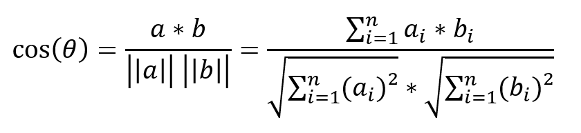
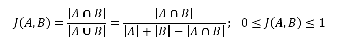

# Auflistung und Erklärung Components
## /pages/
### Account
- Account Einstellungen
- Daten speichern durch FormData Objekt, damit Profilbilder mitgegeben und gespeichert werden können

### Artist
- Artist Page
- immer verbunden mit /kuenstler/:id URL, somit automatisches laden von Artist-Daten bei Page-Refresh
- Tag-System und EventList eingebunden

### Dashboard
- Startseite eingeloggte Benutzer
- Einbindung von verschiedenen Recommender Systemen

### Event
- Detail-Ansicht eines Events
- immer verbunden mit /event/:id URL, somit automatisches laden von Event-Daten bei Page-Refresh
- zwei eingebundene Modals, für weitere Informationen
- Verlinkungen zu Location- und Artist-Pages
- Entfernungsberechnung durch */js/components/helpers/geoCoding.js*
- EventStatusButtons für ändern von Watchlistentry-Status
- Anzahl an Interessierten und Zusagen, mit Update bei Status Änderungen
- Verlinkung zu EventForm für Updates
- Anzeige und Erstellung von Beiträgen und Kommentaren

### EventForm
- Formular für Event-Erstellung und -Update
- Eingebundenes Formular für Location-Erstellung
- Bei Update einbinden von LineUpModal
- v-select für Locations
- v-select für Artists mit Mehrfachauswahl, inklusive Erstellung
- Notifications bei erstellung von Künstler mit änhlichem Namen zu vorhandenen, wird bestimmt durch string-similarity Package
- Eingebundene EventPreview 
- Daten speichern durch FormData Objekt, damit Eventflyer mitgesendet und gespeichert werden können

### Friends
- Auflistung von Freunden und Freundschaftsanfragen
- Suche nach Usernames und Möglichkeit Freundschaftsanfragen zu senden
- Nutzer jeweils dargestellt durch UserBox-Component

### Location
- Detailseite für Location-Informationen
- Möglichkeit Location-Daten zu aktualisieren
- Auflistung von Bevorstehenden und Vergangenen Veranstaltungen

### SearchResults
- Einfache String-Suche nach Namen von Events, Künstlern oder Locations
- Verlinkungen zu jeweiligen Seiten

## /modals/
### DistanceInfoModal
- genutzt in Event Ansicht
- Simples Modal zur Information das Routen mit Open Source berechnet werden
- wird aufgerufen durch "?"-Button bei Kilometer-Entfernung

### ImageModal
- genutzt in Event Ansicht
- Simples Modal welches den hochgeladenen Flyer in Bildschirmgröße anzeigt
- wird aufgerufen durch klicken auf den abgeschnittenen Flyer bei Event  Ansicht

### LineUpModal
- genutzt in EventForm für Updates
- zeigt Artists über LineUpArtist-Component an
- neue Künstler lassen sich hier durch v-select hinzufügen oder entfernen
- v-select für Artists mit Mehrfachauswahl, inklusive Erstellung
- Notifications bei erstellung von Künstler mit änhlichem Namen zu vorhandenen, wird bestimmt durch string-similarity Package

### LocationFormModal
- genutzt in EventForm
- Modal für Location Erstellung

## /layouts/
### ArtistTags
- wird genutzt in Arist-Pages
- Anzeigen und Entfernen von Tags
- v-select für Auswahl und Erstellung von Tags

### CreatePost
-  wird genutzt in Event Ansicht und Posts
-  Erstellung von Posts und Kommentaren zu Posts

### EventList
- genutzt in Artist und Location Ansicht
- Auflistung von Events mit kompakten Informationen
- Informationen werden je nach Parent-Component angezeigt
    - Wenn Parent Location, dann werden Lineup Infos gezeigt
    - Wenn Parent Künstler, dann werden Location Infos gezeigt

### EventPreview
- wird genutzt in EventForm
- zeigt eine Vorschau der eingegebenen Event-Daten

### EventStatusButtons
- wird genutzt in Event Ansicht und EventTeaser
- ändert den Watchlist-Status des Events
- Anhand von aktuellem Status werden andere Buttons angezeigt

### EventTeaser
- wird genutzt auf Dashboard in Carousels
- kleine Event Ansicht mit kompakten Informationen und EventStatusButtons
- Klick auf Teaser leitet auf Event Seite weiter

### EventTeaserCarousel
- Carousel durch vue3-carousel
- zeigt ein Array von Events als EventTeaser an

### LineUpArtist
- wird genutzt in LineUpModal
- zeigt Artist Namen
- Möglichkeit Künstler zu Entfernen, mit Confirmation Frage

### Navbar
- Navigations Bar
- Links zur Startseite, Event-Erstellung, Freunde und Account
- Text-Input für Suche
- Link für Logout

### PostContent
- wird genutzt in Posts
- Zeigt eigentlichen Beitrag oder Kommentar an
- nutzt UserBox um Verfasser des Beitrages anzuzeigen
- berechnet ungefähre Zeitspanne seit dem Posten

### Posts
- wird genutzt in Event Ansicht
- rendert Array von Posts mit Kommentaren in einem Accordion

### Toast
- wird über App genutzt
- kleines Pop-Up Fenster in der unteren rechten Ecke
- wird meist aufgerufen bei Fehlerhaften Requests durch Funktion in */resources/js/components/helpers/toast.js*
- Funktionalität von Bootstrap

### UserBox
- wird genutzt bei Freunde-Seite und Posts
- anzeigen von Nutzer mit Bild und Name
- Buttons für Freunde-Status-Änderungen
- Buttons können über Parent "ausgeschaltet" werden

## /recommender/
### AllEvents
- wird genutzt in Dashboard
- Darstellung von allen aktuellen Events

### Watchlist
- wird genutzt in Dashboard
- Darstellung von allen aktuellen Watchlist-Einträgen

### FriendWatchlists
- wird genutzt in Dashboard
- Darstellung von allen aktuellen Events an denen Freunde Interessiert sind oder Zugesagt haben
- Gewichtete Reihenfolge
    - ein Freund ist Interessiert erhöht die Gewichtung um 1
    - eine Zusage eines Freundes erhöht die Gewichtung um 2

### CosineSimilarity
- wird genutzt in Dashboard
- Darstellung von Event Vorschlägen anhand der Cosine Similarity
- Ermittelt Ähnlichkeit zweier Vektoren durch Berechnung des Kosinus-Winkels
- Möglichkeit zwei Dokumente oder Texte zu vergleichen anhand von Häufigkeitsvektoren

Ablauf Cosine Similarity:
- Iteration durch Watchlist-Einträge und Extrahieren von ArtistTags in das Event
- Iteration durch alle Events und Extrahieren von ArtistTags in das Event
- Iteration durch alle Events
    - Iteration durch alle Watchlist-Einträge
        - Wörter zählen in Event-Tags und Watchlist-Eintrag-Tags
        - "Wörterbuch" aus Wörteranzahlen
        - Häufigkeitsvektoren für jeweiliges Event anhand von Wörterbuch
        - Berechnung Cosine Similarity
        - Bei bestimmten Schwellenwert Event zu Similar-Array pushen

Formel Cosine-Similarity:

### JaccardIndex
- wird genutzt in Dashboard
- Darstellung von Event Vorschlägen anhand des Jaccard Index
- Ermittelt Ähnlichkeit zweier Gruppen
- wird definiert durch die Größe der Schnittmenge geteilt durch die Größe der Vereinigung der jeweiligen Gruppen

Ablauf Jaccard Index:
- Iteration durch Watchlist-Einträge und Extrahieren von ArtistTags in das Event
- Iteration durch alle Events und Extrahieren von ArtistTags in das Event
- Iteration durch alle Events
    - Iteration durch alle Watchlist-Einträge
        - Berechnung Jaccard Index
        - Bei bestimmten Schwellenwert Event zu Similar-Array pushen

Formel Jaccard Index:

